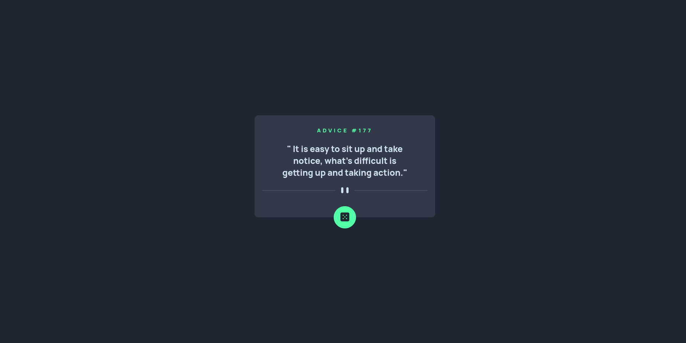
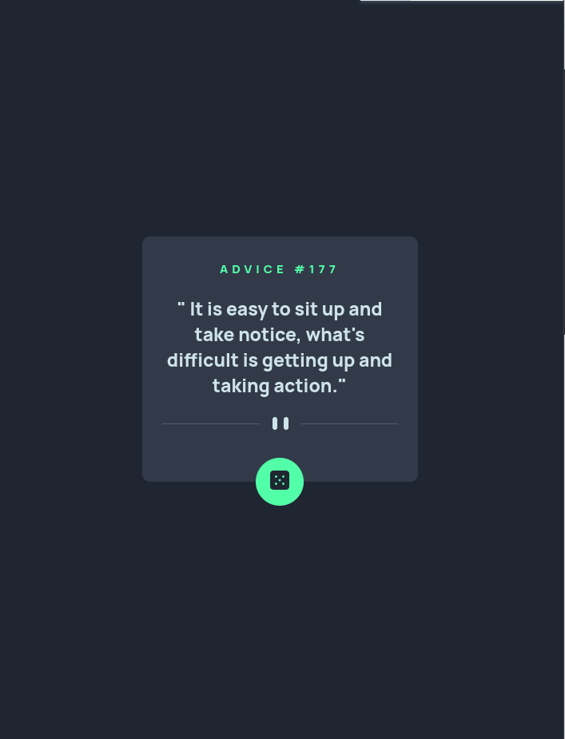

# Advice generator app - Frontend Mentor

## Índice

- [Advice generator app - Frontend Mentor](#advice-generator-app---frontend-mentor)
  - [Índice](#índice)
  - [Sobre](#sobre)
  - [Tecnologias](#tecnologias)
  - [Pré-visualização Desktop](#pré-visualização-desktop)
  - [Pré-visualização Modile](#pré-visualização-modile)
    - [Links](#links)
  - [Autor](#autor)

## Sobre

Nesse projeto foi bem desafiador centralizar os elementos, mais no fínal deu tudo certo, para frente e avante!

## Tecnologias

- HTML
- CSS

## Pré-visualização Desktop

## Pré-visualização Modile

### Links

- Solution URL: [Solution URL](https://www.frontendmentor.io/solutions/advice-generator-app-frontend-mentor-K2rYmF_0G1)
- Live Site URL: [Live site URL](https://wagnerpx.github.io/Advice-generator-app/)

## Autor

- Guithub - [Wagnerpx](https://github.com/wagnerpx)
- Fronted Mentor - [@Wagnerpx](https://www.frontendmentor.io/profile/wagnerpx)
- LinkedIn - [Wagner Alexandre](https://www.linkedin.com/in/wagnerpx/)